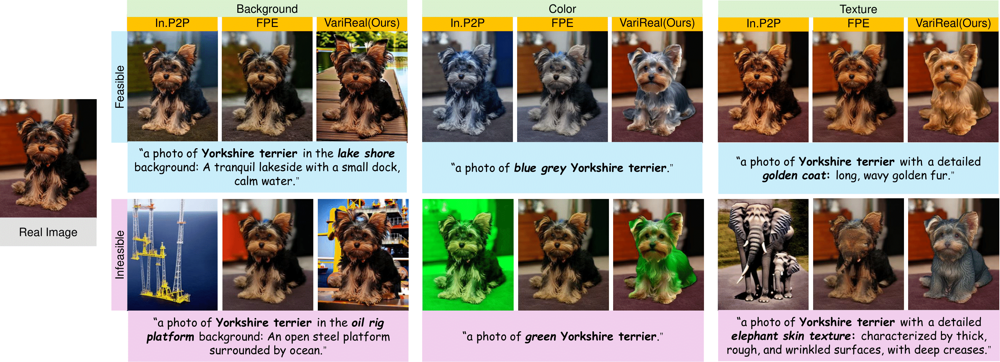
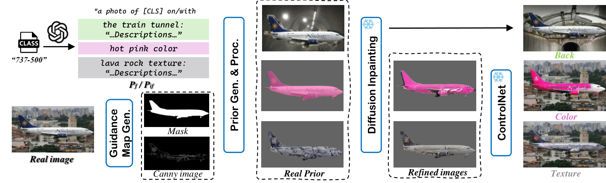
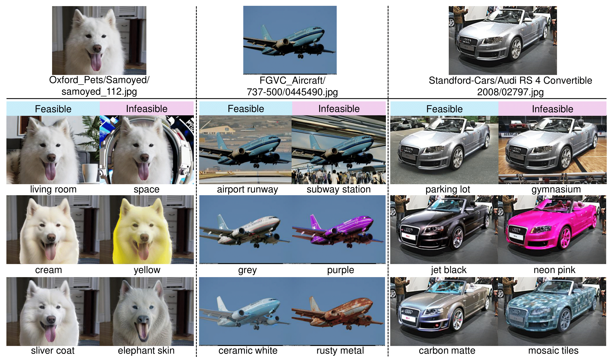

# [CVPRW 2025] Does Feasibility Matter? Understanding the Impact of Feasibility on Synthetic Training Data
[](https://arxiv.org/pdf/2505.10551)

**Authors:** Yiwen Liu, Jessica Bader, Jae Myung Kim

---

## 🔍 Abstract



With the development of photorealistic diffusion models, models trained in part or fully on synthetic data achieve progressively better results. However, diffusion models still routinely generate images that would not exist in reality, such as a dog floating above the ground or with unrealistic texture artifacts.

We define the concept of **feasibility** as whether attributes in a synthetic image could realistically exist in the real world. Images violating this are **infeasible**, and often considered out-of-distribution (OOD). This raises a critical question: **Does feasibility matter when training classifiers with synthetic data?**

In this work, we introduce **VariReal**, a pipeline that minimally edits source images to insert feasible or infeasible attributes via language-prompted diffusion models. Our study evaluates whether enforcing feasibility affects downstream CLIP classifier performance across background, color, and texture attributes.

Key findings:
- Feasibility affects performance marginally (typically <0.3% difference in top-1 accuracy).
- Some attributes (e.g., texture) influence performance more than others.
- Mixing feasible and infeasible samples does not significantly degrade model performance.

---

## Method Overview



We propose the **VariReal** pipeline to generate minimally-edited synthetic images and evaluate their feasibility impact via CLIP fine-tuning.

---

## ⚙️ Setup Instructions

You can set up your virtual environment following the below instructions. 

### 1. Download our github Repository
First, download the our github repo and navigate to the project’s root directory `SyntheticDataFeasibility/`. Due to we use SAM2 model, you need to update the submodule to clone the SAM2.
```bash
git clone https://github.com/Yiveen/SyntheticDataFeasibility.git
cd SyntheticDataFeasibility
git submodule update --init --recursive
```

### 2. Create a Virtual Environment
Create a virtual environment using Python 3.10 and activate the virtual environment.
```bash
conda create -n varireal python=3.10
conda activate varireal
```

### 3. Install Dependencies
Install all requirements via pip.
```bash
conda install pytorch==2.3.0 torchvision==0.18.0 pytorch-cuda=12.1 -c pytorch -c nvidia
pip install -r requirements.txt
```
Install and download the SAM2 related.
```bash
cd VariReal/third_party
pip install -e .
cd checkpoints && ./download_ckpts.sh && cd ..
```

**Optional Fix:** In case of numpy version conflicts with SAM2:

```bash
pip install numpy==1.26.4
```


## 🔧 Usage

We provide a bash example script:  
`SyntheticDataFeasibility/VariReal/sbatch/example_feasible_cars.sh`

You must edit the paths in:
- `example_feasible_cars.sh`
- `VariReal/src/local.yaml`

💡 *Ensure ~150 GB of free space for datasets, pretrained models, and generated outputs.*

#### ▶️ Run

```bash
python SyntheticDataFeasibility/VariReal/src/main_pipeline.py \
  --datasets_root "$ROOT_DIR" \
  --real_train_dir "$REAL_TRAIN_DIR" \
  --output_dir "$OUT_DIR" \
  --csv_path "$CSV_DIR" \
  --feasiblity \
  --texture \
  --images_per_real "$PER_REAL" \
  --batch_size "$BS" \
  --dataset "$DATASET" \
  --gen_class "$CLS" \
  --yaml_file "$YAML_DIR" \
  --use_vlm_filtering
```

**Flag Descriptions:**
- `--datasets_root`: Root folder of your downloaded real dataset.
- `--real_train_dir`: Folder with class-sorted real training images.
- `--output_dir`: Path to store generated synthetic images.
- `--csv_path`: Path to store metadata for generated images.
- `--feasiblity`: Flag to enable *feasible* image generation. Use `--infeasiblity` for infeasible.
- `--back`, `--color`, `--texture`: Specify which attribute to manipulate.
- `--images_per_real`: Number of synthetic images per real image (default: 5).
- `--batch_size`: Number of images generated per batch (recommended: 1).
- `--dataset`: Dataset name (e.g., `cars`, `aircraft`).
- `--gen_class`: Class name to generate images for.
- `--yaml_file`: Path to YAML config file.
- `--use_vlm_filtering`: Optional flag to enable MLLM-based post-filtering.
#### ⚙️ Key Flags

- `--feasibility` enables feasible image generation.
- `--back`, `--color`, `--texture` select target attributes.
- `--use_vlm_filtering` enables multimodal language model (MLLM) filtering.

---

To launch generation:

```bash
bash VariReal/sbatch/example_feasible_cars.sh
```
### B. CLIP Fine-Tuning

#### 🔧 Setup

We provide two example scripts:
- `Finetune/classify/sbatch/bash_example_finetune_cars.sh`
- `Finetune/classify/sbatch/sbash_example_clip_finetune_cars.sh`

Update paths in both scripts and in:  
`Finetune/classify/local_yaml/local_cars.yaml`

#### ▶️ Run

```bash
python SyntheticDataFeasibility/Finetune/classify/main.py \
  --model_type=clip \
  --output_dir=$OUTPUT_DIR \
  --n_img_per_cls=$NIPC \
  --is_lora_image=True \
  --is_lora_text=True \
  --is_synth_train=$SYNTHETIC_TRAIN \
  --is_real_shots=$REAL_TRAIN \
  --lambda_1=$LAMBDA_1 \
  --warmup_epochs=$WARMUP_EPOCH \
  --log=wandb \
  --wandb_project=Finetune_test \
  --dataset=$DATASET \
  --n_shot=$N_SHOT \
  --lr=$LR \
  --wd=$WD \
  --min_lr=$MIN_LR \
  --is_mix_aug=$IS_MIX_AUG \
  --infeasible=$INFEASIBLE \
  --feasible=$FEASIBLE \
  --back=$BACK \
  --color=$COLOR \
  --texture=$TEXTURE \
  --no_mask=$NO_MASK \
  --csv_path=$CSV_DIR \
  --yaml_file=$YAML \
  --total_iterations=$TOTAL_ITER \
  --val_iter=$VAL_ITER
```

**Flag Highlights:**
- `--feasible`, `--infeasible`: Specify data feasibility.
- `--back`, `--color`, `--texture`: Select data attributes.
- `--lambda_1`: Loss combination weight (default: 0.5).
- Other flags set training hyperparameters.

To launch fine-tuning:

```bash
bash Finetune/classify/sbatch/bash_example_finetune_cars.sh 0
```
The trailing number (e.g., `0`) refers to the specific experimental setup index.


## 🖼️ Qualitative Results

We visualize images generated by our VariReal pipeline:


---

## Acknowledgements

We thank [DataDream](https://github.com/ExplainableML/DataDream) for providing the finetune related code. Meanwhile, we acknowledge [VisMin](https://github.com/rabiulcste/vismin) for providing us with image checking inspirations with MLLMs.

---

## 📚 Citation

If you find this work useful, please consider citing:

```bibtex
@article{yiwen2025feasibility,
  title={Does Feasibility Matter? Understanding the Impact of Feasibility on Synthetic Training Data},
  author={Liu, Yiwen and Bader, Jessica and Kim, Jae Myung},
  journal={arXiv preprint arXiv:2505.10551},
  year={2025}
}
```


